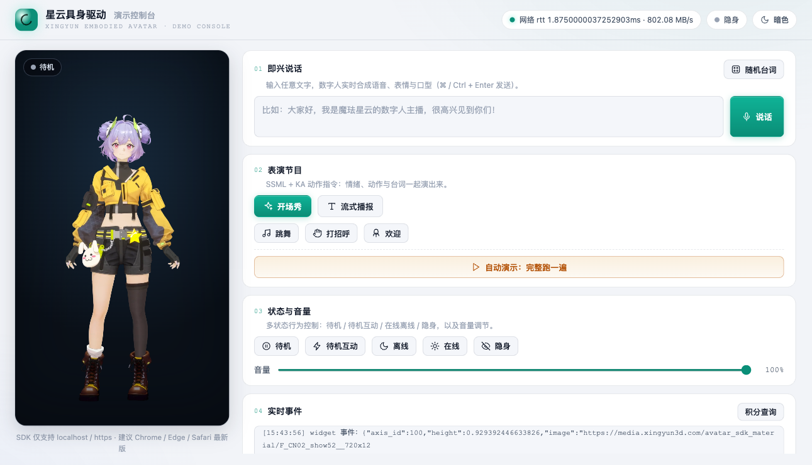

# 星云具身驱动 · 数字人表演控制台

基于 [魔珐星云具身驱动 SDK（JS 版本）](https://xingyun3d.com/developers/52-183) 的**零依赖**演示项目：
一个页面跑通「创建实例 → 初始化房间 → 语音合成 → 表情口型 → 动作指令 → 状态控制 → 积分查询」完整接入流程，
适合产品宣传演示、能力体验与技术验证。



## ✨ 功能玩法

| 玩法 | 对应能力 | 实现方式 |
| --- | --- | --- |
| 🎤 即兴说话 | 语音合成 + 口型同步 | 输入任意文字，`speak(text, true, true)` 整句播报 |
| 🎲 随机台词 | 即兴互动 | 一键从台词池抽取有趣台词填入输入框 |
| 📺 流式播报 | 对接大模型流式输出 | 台词按标点切块，定时逐段调用 `speak`（首段 `is_start=true`，末段 `is_end=true`） |
| ⚡ 开场秀 / 跳舞 / 打招呼 | SSML + KA 动作指令 | `<ue4event>` 语义 KA（`ka_intent`）与技能 KA（`action_semantic`） |
| 🎬 自动演示 | 全流程一键展示 | 脚本化串联：打招呼 → 自我介绍 → 流式播报 → 跳舞 → 谢幕，语音播完自动推进下一段，可随时停止 |
| 🎛️ 状态遥控 | 多状态行为控制 | `idle()` / `interactiveidle()` / `onlineMode()` / `offlineMode()` / `switchInvisibleMode()` |
| 📝 字幕条 | Widget 事件系统 | `onWidgetEvent` 路由 `subtitle_on` / `subtitle_off`，渲染到自绘字幕条 |
| 📡 实时事件流 | 回调与日志系统 | 状态、语音、网络（rtt / 下行速率）、首帧渲染耗时实时上屏 |
| 💰 积分查询 | 消耗查询接口 | 服务端代理 `GET /user/v1/external/consume_record`（含官方签名算法），规避浏览器跨域 |
| 🌗 亮 / 暗主题 | 演示体验 | 一键切换，localStorage 记忆选择，默认亮色 |

## 🚀 快速开始

> 前置条件：先到 [xingyun3d.com](https://xingyun3d.com) 登录，在「应用中心」**创建驱动应用**
> （选择角色、音色、表演风格），拿到 `App ID` 与 `App Secret`。

### 方式一：本地运行（Node ≥ 18.17，零依赖）

```bash
# 1. 配置环境变量
cp .env.example .env
#    编辑 .env，填入 XMOV_APP_ID / XMOV_APP_SECRET

# 2. 启动
npm start            # 或 node server.js

# 3. 浏览器打开
#    http://localhost:3000
```

### 方式二：Docker 一键运行

镜像由 GitHub Actions 自动构建并发布到 GHCR（`ghcr.io/likebeans/xingyun3d:latest`）：

```bash
# 使用 docker compose（推荐）
git clone https://github.com/likebeans/xingyun3D.git
cd xingyun3D
cp .env.example .env      # 填入凭证
docker compose up -d --build
# 打开 http://localhost:3000

# 或直接 docker run（无需克隆仓库）
docker run -d -p 3000:3000 \
  -e XMOV_APP_ID=你的AppID \
  -e XMOV_APP_SECRET=你的AppSecret \
  ghcr.io/likebeans/xingyun3d:latest
```

### 方式三：GitHub Codespaces（网页版一键体验）

1. 打开仓库主页 → 点击 **Code** → **Codespaces** → **新建 Codespace**；
2. 环境已自动配置好 Node 20，并自动把 `.env.example` 复制为 `.env`；
3. 填入 `XMOV_APP_ID` / `XMOV_APP_SECRET`，运行 `npm start`；
4. 点击自动转发的 3000 端口即可开始玩。

## ⚙️ 环境变量

| 变量 | 必填 | 说明 |
| --- | --- | --- |
| `XMOV_APP_ID` | ✅ | 驱动应用 App ID（应用中心创建后获取） |
| `XMOV_APP_SECRET` | ✅ | 驱动应用 App Secret |
| `XMOV_GATEWAY_SERVER` | 否 | 服务网关地址，默认 `https://nebula-agent.xingyun3d.com/user/v1/ttsa/session` |
| `XMOV_AUTHORIZATION` | 否 | 自定义 `Authorization` 请求头，留空则不发送 |
| `PORT` | 否 | 服务端口，默认 `3000` |

`.env` 已加入 `.gitignore`，凭证不会提交到仓库；公开仓库请务必不要提交真实凭证。

## 📁 项目结构

```
xingyun3D/
├── .env.example              # 环境变量模板（复制为 .env 后填写）
├── server.js                 # 零依赖 Node 服务：注入配置 + 代理积分查询 + 静态文件
├── package.json              # npm start（Node ≥ 18.17，无任何依赖）
├── Dockerfile                # 容器镜像定义
├── docker-compose.yml        # Docker 一键编排
├── .devcontainer/            # GitHub Codespaces 一键环境
├── .github/workflows/
│   ├── ci.yml                # CI：语法检查 + 无凭证/假凭证启动冒烟测试
│   └── docker-publish.yml    # 推 main / v* 标签时构建并发布 GHCR 镜像
├── docs/
│   └── screenshot.png        # 演示截图
└── public/
    ├── index.html            # 演示页面：左侧数字人舞台 + 右侧控制台
    ├── style.css             # 亮/暗双主题（CSS 变量驱动，含 prefers-reduced-motion 降级）
    └── main.js               # SDK 接入全流程：创建实例 → init → speak → 状态控制 → destroy
```

## 🔌 接入流程（对照官方文档）

1. **引入 SDK**：`<script src="https://media.xingyun3d.com/xingyun3d/general/litesdk/xmovAvatar@latest.js">`
2. **创建实例**：`new XmovAvatar({ containerId, appId, appSecret, gatewayServer, headers, hardwareAcceleration, ...回调 })`
3. **初始化房间**：`sdk.init({ onDownloadProgress, initModel: 'normal' })`（`onDownloadProgress` 为必填参数）
4. **驱动说话**：`sdk.speak(ssml, is_start, is_end)`，支持整句与流式两种模式
5. **状态控制**：`idle()` / `interactiveidle()` / `offlineMode()` / `onlineMode()` / `switchInvisibleMode()` / `setVolume()`
6. **销毁**：页面卸载前调用 `sdk.destroy()`（官方最佳实践，也用于释放房间）

官方文档：[具身驱动接入文档（52-183）](https://xingyun3d.com/developers/52-183)

## 🔄 GitHub Actions 说明

| 工作流 | 触发时机 | 作用 |
| --- | --- | --- |
| `CI` | push / PR | 语法检查；无凭证启动应提示未配置；假凭证启动应正确注入配置；静态资源 200 |
| `Docker 镜像发布` | push 到 main 或打 `v*` 标签 | 构建镜像并发布到 GHCR，产出 `ghcr.io/likebeans/xingyun3d:latest` |

> 首次发布后，仓库 Settings → Packages 中可看到该镜像包；Actions 使用自动生成的
> `GITHUB_TOKEN`（具备 `packages: write` 权限），无需额外配置 Secret。

## ⚠️ 注意事项

- **SDK 仅支持 `localhost` 或 `https` 访问**，直接以 IP + 端口访问会报错；
- **一个驱动应用同时只允许一个会话**（错误码 `10005`）：请只开一个标签页；
  若看到「房间并发超限」红色横幅，关闭其它标签页后点「重新连接」；
- `speak` 不允许连续多次调用，一次说完后建议用 `interactiveidle()` 做状态切换
  （自动演示已按此模式编排）；
- 首次加载需下载数字人素材，**耐心等待进度条到 100%**（之后有缓存）；
- 长时间不互动可切入**离线模式**，不消耗积分；调试阶段建议使用基础音色；
- 建议使用最新版 Chrome / Edge / Safari。

## 🛠️ 定制与宣传扩展

- **接入 LLM**：把「流式播报」的定时器换成大模型 SSE 流式接口，即成为实时 AI 数字人主播；
- **场景化台词**：在 `public/main.js` 的 `KA` / `STREAM_TEXT` / `RANDOM_LINES` / `DEMO_SCRIPT`
  中替换成产品发布会、门店导购、展厅讲解等脚本；
- **对外部署**：镜像已支持任意容器平台（云服务器 / 内网），或部署到支持 Node 的 PaaS；
  注意使用 https 域名访问。
