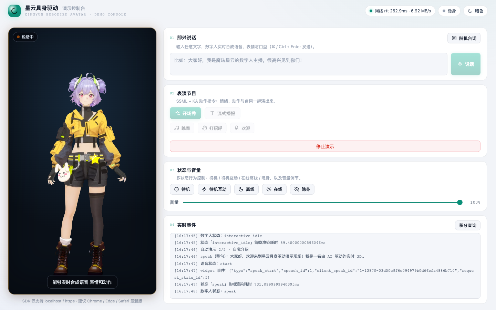
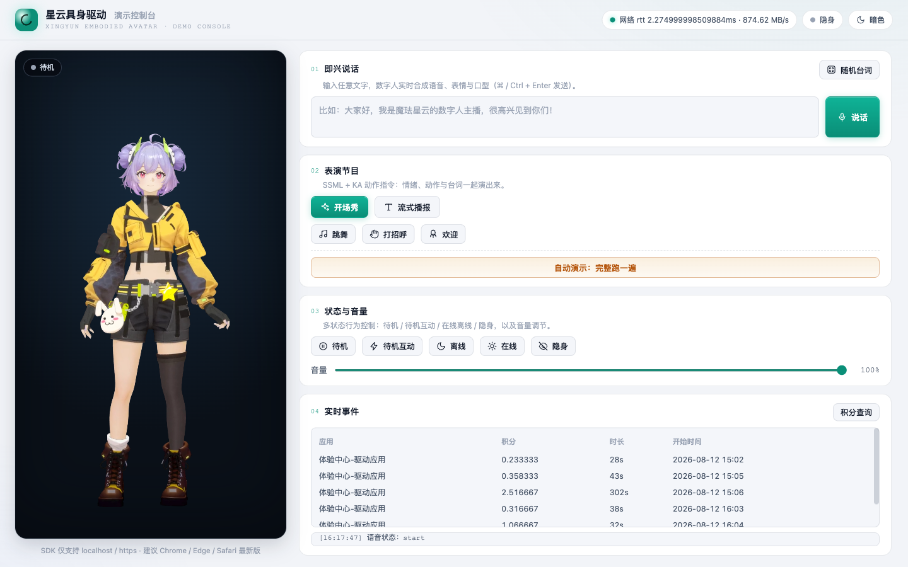

# 拆解星云具身驱动 SDK：语音、口型、表情、动作如何 500ms 联动

上一篇文章我展示了「5 分钟接一个会说话的 3D 数字人」。这一篇往里走一层，拆解这套 SDK 的**设计结构和关键 API**，看看「语音 + 口型 + 表情 + 动作」到底是怎么在一个低延迟链路里联动的。



（在线体验：https://likebeans.github.io/xingyun3D/ ；源码：https://github.com/likebeans/xingyun3D ；注册邀请码 **XDZARL7NEP** 送 1000 积分。）

---

## 一、核心架构：参数流 + AI 端渲

先理解一个关键点：这套 SDK **不下发视频，下发「参数」**。

一次 `speak(text)` 之后，云端把文本处理成多路**参数流**下发：

- **音频流**：合成的语音；
- **表情/口型参数**：面部动作、口型对齐；
- **动作参数**：身体动作、KA 动作（手势、跳舞、欢迎等）；
- **事件流**：字幕、图片、视频等 Widget 事件。

浏览器端拿到参数后**在本地实时渲染**出画面。这就是官方说的「参数流 + AI 端渲」。

它的好处很直接：

1. **不用传输视频** → 带宽小、能做大规模并发（官方标称千万级）；
2. **端侧渲染** → 延迟低（端到端 500ms 量级）、画质随终端缩放；
3. **轻量** → 不挑高端 GPU，官方说百元芯片也能跑。

这也解释了为什么它能「一套 SDK 适配屏幕、人形机器人、AR/VR 眼镜」——渲染逻辑和载体解耦，参数流可以驱动任何能渲染的终端。

---

## 二、`speak`：整句 vs 流式

SDK 最核心的接口就一个：

```js
sdk.speak(ssml, is_start, is_end)
```

- **整句**：`speak('欢迎使用魔珐星云', true, true)`
- **流式**：第一段 `is_start=true`，最后一段 `is_end=true`，中间 `false`

`ssml` 参数既可传纯文本，也可传 SSML 标记语言（下文）。

流式是接大模型的命门——我在《给数字人接上大模型》那篇里详细讲了，这里不重复。

---

## 三、SSML + KA 动作指令：让数字人「演」起来

光说话不够，数字人最大的差异化是**情绪和动作**。SDK 用 SSML 里的 `<ue4event>` 标签控制动作，我整理成三类：

**1. 语义 KA（根据语义触发动作）**

```xml
<speak>
  热烈
  <ue4event><type>ka_intent</type><data><ka_intent>Welcome</ka_intent></data></ue4event>
  欢迎各位贵宾莅临指导！
</speak>
```

**2. 技能 KA（指定动作，如跳舞）**

```xml
<speak>
  <ue4event><type>ka</type><data><action_semantic>dance</action_semantic></data></ue4event>
  音乐响起来，一起跳舞吧！
</speak>
```

**3. Speak KA（动作 + 台词）**

```xml
<speak>
  <ue4event><type>ka</type><data><action_semantic>Hello</action_semantic></data></ue4event>
  欢迎来到星云具身 3D 数字人平台～
</speak>
```

项目里的「开场秀」「跳舞」「打招呼」按钮，本质就是这三类 SSML。注意不同应用/角色支持的 KA 动作库不一样——我实测时发现某个角色对 `Welcome` 返回了 `ka intent not found`，说明 **KA 动作要按你创建的应用实际支持情况来用**。

---

## 四、Widget 事件系统

SDK 内置了对几种事件的默认渲染（`subtitle_on` 字幕、`subtitle_off`、`widget_pic` 图片）。你可以用 `onWidgetEvent` 或 `proxyWidget` 自定义。

**重点：优先级是 `onWidgetEvent` > `proxyWidget` > 默认事件**——一旦定义了 `onWidgetEvent`，所有事件都走它，`proxyWidget` 不再触发（这是我在踩坑篇里记录过的坑 7）。

```js
onWidgetEvent(data) {
  if (data.type === 'subtitle_on')  { showSubtitle(data.text); return; }
  if (data.type === 'subtitle_off') { hideSubtitle(); return; }
  // 其它事件……
}
```

---

## 五、回调体系：把状态「管起来」

一个健壮的接入，几乎要挂全这些回调：

| 回调 | 作用 |
| --- | --- |
| `onDownloadProgress` | 资源下载进度（`init` 参数，**必填**） |
| `onVoiceStateChange` | 音频播放状态 `start` / `end`，用于管理说话状态 |
| `onStateChange` | 数字人状态变化（idle / interactive_idle / speak…） |
| `onStateRenderChange` | 状态切换耗时（发 action 到首帧渲染） |
| `onStatusChange` | SDK 状态（在线/离线/隐身/网络…） |
| `onMessage` | 错误/消息（含错误码） |
| `onNetworkInfo` | 网络延迟 rtt、下行速率 |
| `onStartSessionWarning` | 数字人配置不正确的警告 |

其中 `onMessage` 里会带**错误码**，是排查问题的第一现场（比如 `10005` 房间并发超限）。

---

## 六、状态机

数字人有一组可主动切换的状态：

| 方法 | 状态 | 说明 |
| --- | --- | --- |
| `idle()` | 待机 | 长时间无交互 |
| `interactiveidle()` | 待机互动 | 交互前的循环状态，**也可用于打断当前说话** |
| `speak()` | 说话 | 核心状态 |
| `offlineMode()` / `onlineMode()` | 离线/在线 | 离线不消耗积分 |
| `switchInvisibleMode()` | 隐身切换 | 主动切换隐身/在线 |

---

## 七、消耗查询：一次完整的签名鉴权

SDK 之外，还有一个 HTTP 接口用来查积分消耗：

```
GET https://nebula-agent.xingyun3d.com/user/v1/external/consume_record
```

它需要三个请求头，其中 **`X-TOKEN` 是签名**，不是直接填 App Secret：

```
X-TOKEN = MD5( 小写路径 + 小写HTTP方法 + 排序JSON体 + Secret + 秒级时间戳 )
```

这个算法官方 SDK 文档里没写，藏在另一篇 KA 接口文档里——这也是我踩坑篇里记录的坑 5。

调通之后，能在前端直接看到自己的积分消耗记录：



---

## 八、小结

把这套 SDK 拆完，我对「具身交互」有了一个具体认知：

> 它把「文本」实时转成「语音 + 表情 + 口型 + 动作」的多模态参数流，再在端侧渲染出来。**参数流 + 端渲**这个架构选择，是它能做到低延迟、高并发、轻量部署、多终端统一的根本原因。

如果你对具体接入感兴趣，开源项目里有完整可跑的代码，填个 env 就能玩：

- 📦 仓库：https://github.com/likebeans/xingyun3D
- 🔗 在线体验：https://likebeans.github.io/xingyun3D/
- 🎁 邀请码 **XDZARL7NEP**：注册送 1000 积分
