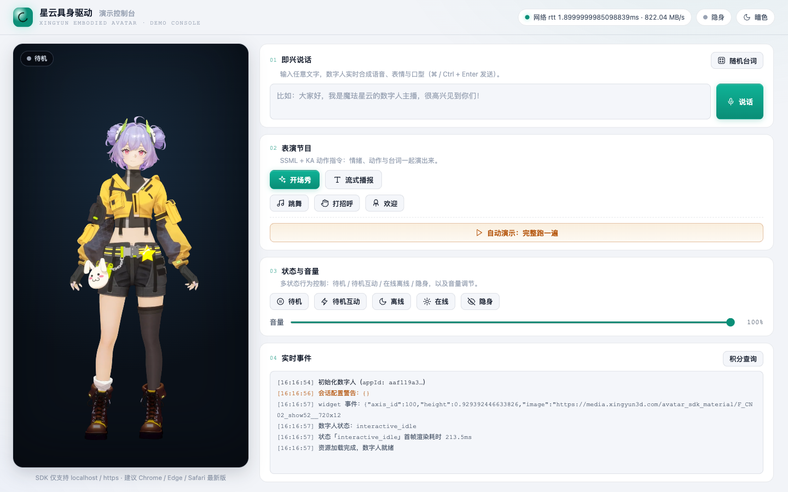
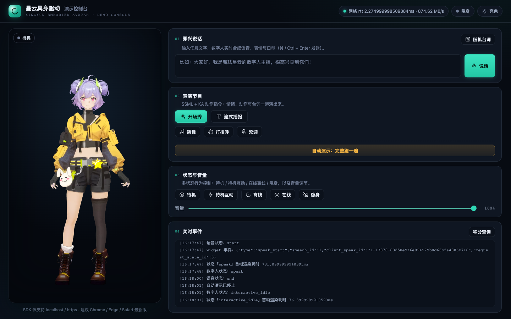

# 实时 3D 数字人落地全记录：SDK 深拆、接大模型、7 个坑、开源工程一键部署

我用魔珐星云的具身驱动 SDK 完整落地了一个「会说话的 3D 数字人」项目，从接入、深拆技术、接大模型、踩坑，到做成开源项目 + CI/CD 一键部署，全程记录在这里。

先看效果（这是浏览器里**实时渲染**的数字人，不是录好的视频）：



你可以直接打开在线版体验（填个 App ID/Secret 就能玩）：

> 🔗 https://likebeans.github.io/xingyun3D/

注册魔珐星云时用邀请码 **XDZARL7NEP**，送 1000 积分。

---

## 一、核心架构：参数流 + AI 端渲

先理解一个关键点：这套 SDK **不下发视频，下发「参数」**。

一次 `speak(text)` 之后，云端把文本处理成多路**参数流**下发：

- **音频流**：合成的语音；
- **表情/口型参数**：面部动作、口型对齐；
- **动作参数**：身体动作、KA 动作（手势、跳舞、欢迎等）；
- **事件流**：字幕、图片、视频等 Widget 事件。

浏览器端拿到参数后**在本地实时渲染**出画面。这就是官方说的「参数流 + AI 端渲」。

它的好处很直接：

1. **不用传输视频** → 带宽小、能做大规模并发（官方标称千万级）；
2. **端侧渲染** → 延迟低（端到端 500ms 量级）、画质随终端缩放；
3. **轻量** → 不挑高端 GPU，官方说百元芯片也能跑。

这也解释了为什么它能「一套 SDK 适配屏幕、人形机器人、AR/VR 眼镜」——渲染逻辑和载体解耦，参数流可以驱动任何能渲染的终端。

---

## 二、核心接口 `speak`：整句 vs 流式

SDK 最核心的接口就一个：

```js
sdk.speak(ssml, is_start, is_end)
```

- **整句**：`speak('欢迎使用魔珐星云', true, true)`
- **流式**：第一段 `is_start=true`，最后一段 `is_end=true`，中间 `false`

`ssml` 参数既可传纯文本，也可传 SSML 标记语言（下文）。

流式是接大模型的命门——下面第八章会详细讲。

---

## 三、SSML + KA 动作指令：让数字人「演」起来

光说话不够，数字人最大的差异化是**情绪和动作**。SDK 用 SSML 里的 `<ue4event>` 标签控制动作，我整理成三类：

**1. 语义 KA（根据语义触发动作）**

```xml
<speak>
  热烈
  <ue4event><type>ka_intent</type><data><ka_intent>Welcome</ka_intent></data></ue4event>
  欢迎各位贵宾莅临指导！
</speak>
```

**2. 技能 KA（指定动作，如跳舞）**

```xml
<speak>
  <ue4event><type>ka</type><data><action_semantic>dance</action_semantic></data></ue4event>
  音乐响起来，一起跳舞吧！
</speak>
```

**3. Speak KA（动作 + 台词）**

```xml
<speak>
  <ue4event><type>ka</type><data><action_semantic>Hello</action_semantic></data></ue4event>
  欢迎来到星云具身 3D 数字人平台～
</speak>
```

项目里的「开场秀」「跳舞」「打招呼」按钮，本质就是这三类 SSML。注意不同应用/角色支持的 KA 动作库不一样——我实测时发现某个角色对 `Welcome` 返回了 `ka intent not found`，说明 **KA 动作要按你创建的应用实际支持情况来用**。

---

## 四、Widget 事件系统

SDK 内置了对几种事件的默认渲染（`subtitle_on` 字幕、`subtitle_off`、`widget_pic` 图片）。你可以用 `onWidgetEvent` 或 `proxyWidget` 自定义。

**重点：优先级是 `onWidgetEvent` > `proxyWidget` > 默认事件**——一旦定义了 `onWidgetEvent`，所有事件都走它，`proxyWidget` 不再触发。

```js
onWidgetEvent(data) {
  if (data.type === 'subtitle_on')  { showSubtitle(data.text); return; }
  if (data.type === 'subtitle_off') { hideSubtitle(); return; }
  // 其它事件……
}
```

---

## 五、回调体系：把状态「管起来」

一个健壮的接入，几乎要挂全这些回调：

| 回调 | 作用 |
| --- | --- |
| `onDownloadProgress` | 资源下载进度（`init` 参数，**必填**） |
| `onVoiceStateChange` | 音频播放状态 `start` / `end`，用于管理说话状态 |
| `onStateChange` | 数字人状态变化（idle / interactive_idle / speak…） |
| `onStateRenderChange` | 状态切换耗时（发 action 到首帧渲染） |
| `onStatusChange` | SDK 状态（在线/离线/隐身/网络…） |
| `onMessage` | 错误/消息（含错误码） |
| `onNetworkInfo` | 网络延迟 rtt、下行速率 |
| `onStartSessionWarning` | 数字人配置不正确的警告 |

其中 `onMessage` 里会带**错误码**，是排查问题的第一现场（比如 `10005` 房间并发超限）。

---

## 六、状态机

数字人有一组可主动切换的状态：

| 方法 | 状态 | 说明 |
| --- | --- | --- |
| `idle()` | 待机 | 长时间无交互 |
| `interactiveidle()` | 待机互动 | 交互前的循环状态，**也可用于打断当前说话** |
| `speak()` | 说话 | 核心状态 |
| `offlineMode()` / `onlineMode()` | 离线/在线 | 离线不消耗积分 |
| `switchInvisibleMode()` | 隐身切换 | 主动切换隐身/在线 |

---

## 七、消耗查询：一次完整的签名鉴权

SDK 之外，还有一个 HTTP 接口用来查积分消耗：

```
GET https://nebula-agent.xingyun3d.com/user/v1/external/consume_record
```

它需要三个请求头，其中 **`X-TOKEN` 是签名**，不是直接填 App Secret：

```
X-TOKEN = MD5( 小写路径 + 小写HTTP方法 + 排序JSON体 + Secret + 秒级时间戳 )
```

这个算法官方 SDK 文档里没写，藏在另一篇 KA 接口文档里。调通之后，能在前端直接看到积分消耗记录：


---

## 八、接大模型：从念稿到实时 AI 主播

这是整套 SDK 最值钱的地方。

### 8.1 为什么「流式」是关键

大模型生成回答是**一个字一个字往外蹦的**（流式输出）。如果等它全部生成完、再一次性丢给数字人去念，那用户要干等十几秒。正确姿势是：**大模型每生成一小段，数字人就同步说一小段**。而 `speak` 接口天生就是流式设计，专门为这个场景准备的。


### 8.2 先看「模拟流式」的实现

在开源项目的 `main.js` 里，我先用定时器模拟了大模型的流式输出（`chunkText` 按标点切块，定时逐段喂给 `speak`）：

```js
function streamSpeak(text, onDone) {
  const chunks = chunkText(text);   // 按标点切成 8~12 字的小段
  let i = 0;
  streamTimer = setInterval(() => {
    sdk.speak(chunks[i], i === 0, i === chunks.length - 1);
    i++;
    if (i >= chunks.length) done(); // 播完回调
  }, 320);
}
```

这段「模拟」就是给真实大模型留的接口——把 `setInterval` 换成大模型的流式回调即可。

### 8.3 接真实大模型：完整代码

下面是一个可落地的示例（OpenAI 兼容接口，`/v1/chat/completions` + `stream: true`）：

```js
async function talkWithLLM(userText) {
  sdk.interactiveidle(); // 先让数字人进入互动待机

  const res = await fetch('https://your-llm-gateway/v1/chat/completions', {
    method: 'POST',
    headers: { 'Content-Type': 'application/json', Authorization: 'Bearer xxx' },
    body: JSON.stringify({
      model: 'your-model',
      stream: true,
      messages: [{ role: 'user', content: userText }],
    }),
  });

  const reader = res.body.getReader();
  const decoder = new TextDecoder();
  let buffer = '', pending = '', isStart = true;

  while (true) {
    const { done, value } = await reader.read();
    if (done) break;
    buffer += decoder.decode(value, { stream: true });

    const lines = buffer.split('\n');
    buffer = lines.pop(); // 最后一个可能不完整，留到下次

    for (const line of lines) {
      if (!line.startsWith('data:')) continue;
      const payload = line.slice(5).trim();
      if (payload === '[DONE]') continue;
      let delta = '';
      try { delta = JSON.parse(payload).choices?.[0]?.delta?.content || ''; } catch {}
      if (!delta) continue;

      pending += delta;
      // 首段积攒一小段再开口，保证口型跟上后续输出速度
      if (pending.length >= 12) {
        sdk.speak(pending, isStart, false);
        isStart = false;
        pending = '';
      }
    }
  }

  if (pending) sdk.speak(pending, isStart, true); // 收尾：结束段
}
```

### 8.4 三个容易翻车的点

1. **`speak` 不允许连续多次调用**：一次 `is_end = true` 之后不能立刻接下一次，中间要用 `interactiveidle()` 做状态切换。
2. **用 `voice_end` 而不是靠猜**：监听 `onVoiceStateChange` 的 `end` 事件判断「说完了」，不要用 `setTimeout` 估时长。
3. **首帧延迟是真实成本**：从 `speak` 到数字人开口渲染首帧，我实测在 200ms~800ms 之间，所以官方强调「首段积攒缓冲」——把延迟藏在缓冲里。

### 8.5 完整的多轮对话状态机

要做出真正的 AI 主播/客服，需要一个**状态机**管理「听 → 想 → 说 → 回待机」的循环：

```js
class AvatarChat {
  state = 'idle';
  pendingText = '';

  async onUserSpeak(text) {
    sdk.interactiveidle();          // 打断当前说话，回待机
    await this.streamFromLLM(text);
  }

  async streamFromLLM(userText) {
    const stream = await callLLMStream(userText);
    let isStart = true;
    for await (const delta of stream) {
      this.pendingText += delta;
      if (this.pendingText.length >= 12) {   // 首段积攒缓冲
        sdk.speak(this.pendingText, isStart, false);
        isStart = false;
        this.pendingText = '';
      }
    }
    if (this.pendingText) sdk.speak(this.pendingText, isStart, true);
  }

  onVoiceStateChange(status) {
    if (status === 'end') {
      sdk.interactiveidle();  // 说完回待机，等下一轮
      this.state = 'idle';
    }
  }
}
```

三个关键点：**`interactiveidle()` 做「打断」**、**状态由 `onVoiceStateChange` 驱动**、**首段缓冲阈值（`12` 字）可调**。

接语音识别（ASR）用 Web Speech API 快速跑通：

```js
const recognition = new webkitSpeechRecognition();
recognition.onresult = (e) => chat.onUserSpeak(e.results[0][0].transcript);
```

「语音输入 → 大模型 → 数字人开口」的完整闭环就打通了。

---

## 九、落地场景

技术最终要落到场景里。具身数字人比普通语音助手多了一条关键能力：**表达**——口型、表情、手势、动作都实时生成，解决的是「信任和氛围」。

**六大场景**：

| 场景 | 说明 |
| --- | --- |
| 直播带货 / 口播 | 7×24 在线，配大模型自动讲解 |
| 新闻播报 / 资讯 | 标准化高频内容，SSML 控语气动作 |
| 门店导购 / 品牌 IP | 线下大屏，离线模式不消耗积分 |
| 展厅 / 发布会讲解 | 「开场秀」Demo 就是为此设计 |
| 智能客服 / 前台 | 大模型 + ASR，面对面答疑 |
| 教育 / 陪伴 | 情感表达比语音更有温度 |

一个「产品发布会」脚本示例（改 `DEMO_SCRIPT` 即可复用）：

| 步骤 | 动作 | 台词（节选） |
| --- | --- | --- |
| 1 | 打招呼 | 欢迎各位来宾莅临本次发布会！ |
| 2 | 自我介绍 | 我是星云具身驱动演示官…… |
| 3 | 流式播报 | （产品卖点逐条流式讲解） |
| 4 | 强调动作 | 请看这里——我们的核心亮点是…… |
| 5 | 谢幕 | 感谢收看，欢迎到体验区亲身体验！ |

**不止屏幕**：同一套 `speak()` 逻辑，可以搬到人形机器人、AR/VR 眼镜——一次开发、多端复用，这是官方「一套 SDK 全终端」的价值所在。

---

## 十、我踩过的 7 个坑

这些坑官方文档要么没写、要么一笔带过，希望能帮你省几个小时。

**坑 1：形象不显示，容器高度塌成 0**
SDK 初始化会**给容器写入自己的内联样式**，覆盖你的 CSS 定位，导致高度塌陷。解决：给容器加 `width/height: 100% !important`。

**坑 2：字幕被形象盖住**
SDK 给 canvas 写了内联 `z-index: 100`，字幕条层级低于它就被压住。解决：字幕/角标提到 `z-index: 200`。

**坑 3：房间并发超限，按钮全「失灵」**
日志里藏着 `[10005] 超出房间并发限制`。一个驱动应用**同时只允许一个会话**，抢不到房间的一方静默失效。解决：遇到 10005 给提示 + 一键重连；平时只开一个标签页。

**坑 4：只能 localhost 或 https**
用 IP + 端口或裸 http 域名会报错。本地用 localhost，对外部署到 https。

**坑 5：`X-TOKEN` 是签名不是明文**
调「消耗查询」时先报「签名超时」再报「签名有误」，真正的算法（见第七章）藏在另一篇 KA 接口文档里。

**坑 6：Safari 舞台横向溢出**
`aspect-ratio` + `flex` 的组合在 Safari 有兼容性 bug。解决：改成显式宽度计算 `calc((100dvh - 136px) * 9 / 16)`。

**坑 7：事件优先级**
`onWidgetEvent` > `proxyWidget` > 默认事件，同时定义两者时后者不触发。

---

## 十一、开源工程化：填个 env 就能玩

我把上面这些都做成了开源项目 [likebeans/xingyun3D](https://github.com/likebeans/xingyun3D)，三种方式覆盖三类人：

| 用户 | 方式 | 门槛 |
| --- | --- | --- |
| 想快速体验的访客 | GitHub Pages 在线版 | 打开 URL，填自己的凭证 |
| 本机调试的开发者 | 本地 / Docker | 一条命令 |
| 想二次开发的人 | Codespaces | 云端一键环境 |

**三级配置自动降级**：服务端环境变量 → 构建期注入 → 浏览器填写，同一个代码库既能当「打开即玩」演示站，也能当「自己填 key」的开放工具。

**三条流水线**（GitHub Actions）：

1. **CI**：`node --check` 语法检查 + 无凭证冒烟测试；
2. **Docker 镜像**：push main 自动发布到 GHCR（`ghcr.io/likebeans/xingyun3d:latest`）；
3. **GitHub Pages**：push main 自动部署在线版。



本地 / Docker 启动：

```bash
# 本地
cp .env.example .env   # 填 XMOV_APP_ID / XMOV_APP_SECRET
npm start              # http://localhost:3000

# Docker
docker run -d -p 3000:3000 \
  -e XMOV_APP_ID=你的AppID \
  -e XMOV_APP_SECRET=你的AppSecret \
  ghcr.io/likebeans/xingyun3d:latest
```

---

## 写在最后

从「一行代码让数字人开口」，到「接大模型做实时 AI 主播」，再到「CI/Docker/Pages 全自动交付」，全程可以零依赖、低成本跑通。**参数流 + AI 端渲**这套架构，让数字人从「播放器」变成了能实时表达、交流的「具身智能体」。

如果你也对这套东西感兴趣，直接上手玩最直观：

- 🎁 邀请码 **XDZARL7NEP**：注册魔珐星云送 1000 积分
- 🔗 在线体验：https://likebeans.github.io/xingyun3D/
- 📦 开源仓库：https://github.com/likebeans/xingyun3D
- 📖 官方文档：https://xingyun3d.com/developers/52-183
- 🌐 官网：https://xingyun3d.com/
